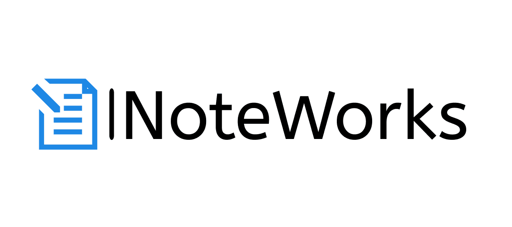
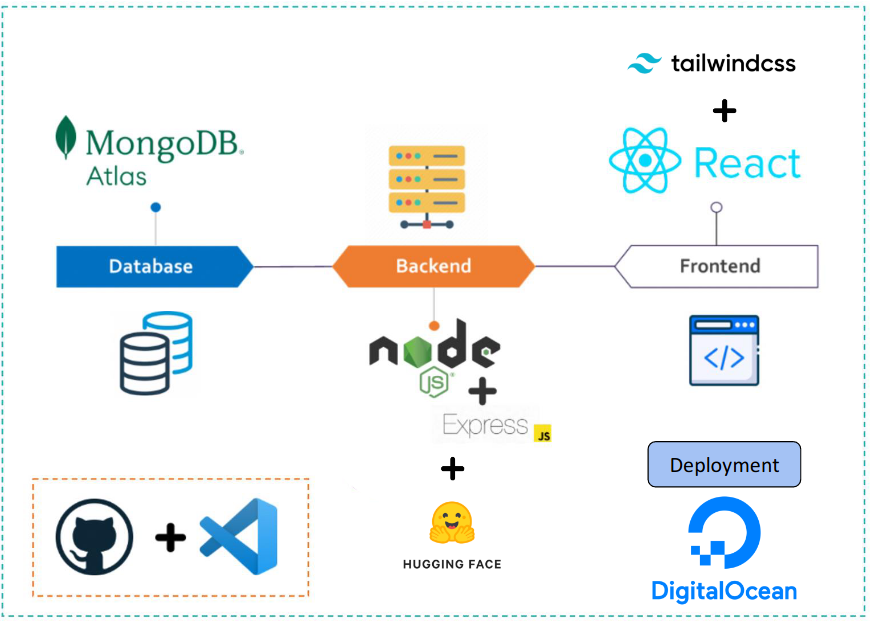

# NoteWorks

<div align="center" style="margin-bottom: 20px;">
  
</div>

NoteWorks is a comprehensive note-taking web application designed to help users create, manage, and organize their notes efficiently. Built with the MERN stack (MongoDB, Express, React, Node.js), NoteWorks offers robust features like user authentication, note searching, AI-powered summarization.

## Features

- User Registration and Authentication
- Create, Edit, and Delete Topics
- Create, Edit, and Delete Notes
- Search Notes by Title, Content, and Tags
- Pin Important Notes
- Summarize Notes with AI

## Tech Stack



- **Frontend**: React, Tailwind CSS
- **Backend**: Node.js, Express.js, Hugging Face Transformation API for summarization
- **Database**: MongoDB Atlas
- **Deployment**: GitHub, DigitalOcean

## Installation

### Clone the Repository

```bash
git clone https://github.com/mffriaslorite/NoteWorks.git
cd NoteWorks
```


### Set Up the Backend

```bash
cd backend
npm install
```

### Set Up the Frontend

```bash
cd ../frontend/noteworks
npm install
```

## Running the application

### Start the Backend Server

```bash
cd backend
npm start
```

### Start the Frontend Development Server

```bash
cd ../frontend/noteworks
npm run dev
```

The application will be running at `http://localhost:3000`


## Deployment

NoteWorks is deployed on a server via DigitalOcean and can be accessed at the following link:

[NoteWorks Live Demo](http://188.166.164.18)


## Authors
Web Surfers
- [@anshuman9714sinha](https://github.com/anshuman9714sinha)
- [@mffriaslorite](https://github.com/mffriaslorite)
- [@R0bert123](https://github.com/R0bert123)

<div align="center">
  
</div>